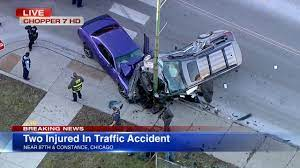
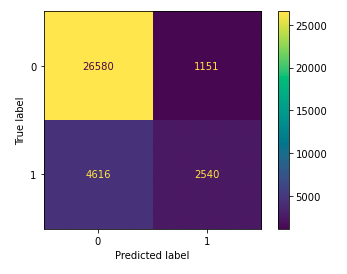
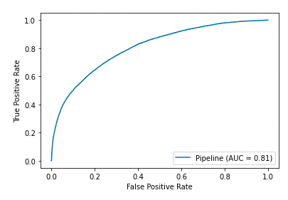
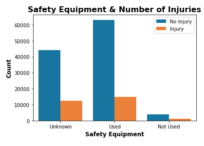
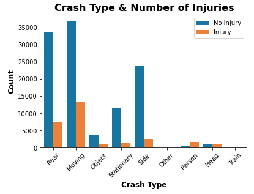
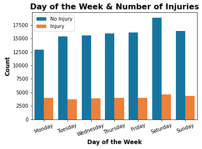
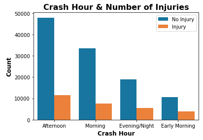

 

# Chicago Vehicle Saftey: 

 
 

## Traffic Accident Injury Detection & Reduction
**Author**: Ashli Dougherty 

## Overview
The goal of this project was to determine how to decrease the number of injuries that occur from car crashes in the city of Chicago. The data used is from the city of Chicago Department of Transportation open data website. Four predictive models were built and the best one was tuned and key features were determined. These key features were analyzed and safety suggestions were reccommended.   
*** 

## Business Problem  
Last year there were 132,967 documented traffic accidents in the city of Chicago. Approximately 20% of all accidents resulted in one or more people injured for a total of 26,593 injuries. The Chicago Department of Transportation is currently working together with [Vision Zero](https://www.chicago.gov/city/en/depts/cdot/supp_info/vision-zero-chicago.html) on a plan to eliminate ALL injuries and fatalities whether your mode of transportation is your personal vehicle, public transit, cycling, or walking. 

As a partner with these two institutions I used historical crash data in order to make our city a safer place for all those who live, work, and vacation here. My approach to this problem was to build a machine learning model that would: 
1. Predict if an injury would be present at an accident site based on a variety of factors.
2. Determine which factors increase the probability of an injury being present. 

The city can then use the identified factors as a starting point for improvements that can increase citizen safety. 
***

## Data
There are three datasets on the City of Chicago's [open data website](https://data.cityofchicago.org/browse?category=Transportation). Based on the site all three data sets are meant to be used in combination with one another. Datasets are very large and were accessed locally in order to bypass Git's Large File Storage systems. All CSVs can be accessed and downloaded from the website.  

I used the following datasets: 
- [Crashes Dataset](https://data.cityofchicago.org/Transportation/Traffic-Crashes-Crashes/85ca-t3if): Crash data shows information about each traffic crash on city streets within the City of Chicago limits and under the jurisdiction of Chicago Police Department (CPD).
- [Vehicles Dataset](https://data.cityofchicago.org/Transportation/Traffic-Crashes-Vehicles/68nd-jvt3): This dataset contains information about vehicles (or units as they are identified in crash reports) involved in a traffic crash.
- [People Dataset](https://data.cityofchicago.org/Transportation/Traffic-Crashes-People/u6pd-qa9d): This data contains information about people involved in a crash and if any injuries were sustained.

Only incidents from the calendar year 2021 will be analyzed as it is the last complete year on record. The number of reports is less than 2018 and 2019 but more than 2020 which indicates that people are driving/using transportation more since the pandemic. 
***

## Modeling
After cleaning the data the following features were included in the model:
- POSTED_SPEED_LIMIT    
- DEVICE_CONDITION     
- WEATHER_CONDITION     
- LIGHTING_CONDITION   
- FIRST_CRASH_TYPE      
- TRAFFICWAY_TYPE      
- ROADWAY_SURFACE_COND  
- INJURIES_TOTAL         
- CRASH_HOUR           
- CRASH_DAY_OF_WEEK     
- CRASH_MONTH                     
- VEHICLE_TYPE          
- PERSON_TYPE          
- SEX                 
- AGE                   
- SAFETY_EQUIPMENT      
- AIRBAG_DEPLOYED      
- DRIVER_VISION    

Models used from sklearn library using default parameters.
- Dummy Classifer (baseline)
- Logistic Regression 
- Random Forests 
- Gradient Booster

**Grid Search**
For model tuning I am going to focus on the Gradient Booster model. It had the highest overall scores. I took this model and performed a grid search to find the optimal parameters for learning_rate, n_estimators, and max_depth. 

The best parameters are as followed. 
- learning_rate: 0.1
- max_depth: 7 
- n_estimators': 1000

SMOTE technique was not utilized as method is not compatable with categorical features.
***

## Final Model
#### Scores

- **Accuracy**: 0.8346948720153639
- **Precision**: 0.688160390138174
- **Recall**: 0.35494689770821686

 

 

## Evaluation
After modeling was complete I used sklearn's permutation importance function in order to determine which features were most important in predicting if an injury occurred. The top 4 returned were: 

1. **SAFETY_EQUIPMENT**

 

2. **FIRST_CRASH_TYPE**

 

3. **CRASH_DAY_OF_WEEK**

 

4. **CRASH_HOUR**     

 
***

## Conclusion 
Based on the features of importance I can reccomend the following to the Chicago Department of Transportaion:
1. Increase access to public transit: Due to the low number of collisions involving buses and trains the DOT and CTA need a strategy to make public transit an option for more people. Decreasing the number of personal vehicles on the road during commuter hours could lead to a decrease traffic incidents.
2. Safety initiatives: Since injuries are more likely to occur between a vehicle and cyclist safeguards should be made to protect them. The city should look into how to create more bike lanes and add protection from vehicles to the ones that already exist. Since safety equipment seems to be failing the city can have PSAs on how to correctly use personal and vehicle safety features such as seat belts and bike helmets
3. Targeted response windows: we now know that accidents resulting in injury occur in the  afternoons and Saturday. This information can be used by Chicago PD and emergency response systems for scheduling and resource allocation. 

## Next Steps
- Increase precision of model.
- These are only crashes that are documented through Chicago Police Department. Comparing records here to insurance claims might give a better idea of total crashes within the city limits. 
- Create a model that determines features most associated with severe injuries.
***

### For More Information
Please review our full analysis in our [Jupyter Notebook](./ChicagoCarCrash.ipynb) or our [presentation](./Chicago Vehicle Safety Presentation.pdf).

For any additional questions, me at ashli.d.dougherty@gmail.com
